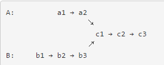

#IntersectionofTwoLinkedLists
Write a program to find the node at which the intersection of two singly linked lists begins.


For example, the following two linked lists:


begin to intersect at node c1.


Notes:

If the two linked lists have no intersection at all, return null.
The linked lists must retain their original structure after the function returns.
You may assume there are no cycles anywhere in the entire linked structure.
Your code should preferably run in O(n) time and use only O(1) memory.

---


//方法1 先计算length
```
int getLen(ListNode *head) {
        int len = 0;
        while(head) { len++; head = head->next; } 
        return len;
    }
    
ListNode *getIntersectionNode(ListNode *headA, ListNode *headB)
{
        if (!headA || !headB) return NULL;
        ListNode *p1 = headA, *p2 = headB;
        int lenA = getLen(headA), lenB = getLen(headB);
    
        if (lenA <= lenB) {
            for (int i = 0; i < lenB - lenA; ++i)
                p2 = p2->next;
        }
        else {
            for (int i=0; i < lenA - lenB; ++i)
                p1 = p1->next;
        }
    
        while (p1 && p2 && p1 != p2) p1 = p1->next, p2 = p2->next;
        if (!p1 || !p2) return NULL;
        return p1;
}
```

方法2: 其实 是利用了同样的原理 但是代码更加简练
```
ListNode *getIntersectionNode(ListNode *headA, ListNode *headB)
{
         ListNode *ptrA = headA, *ptrB = headB;
        while (ptrA != ptrB) { 
            ptrA = ptrA ? ptrA->next : headB;
            ptrB = ptrB ? ptrB->next : headA;
        }
        return ptrA;
}
```
